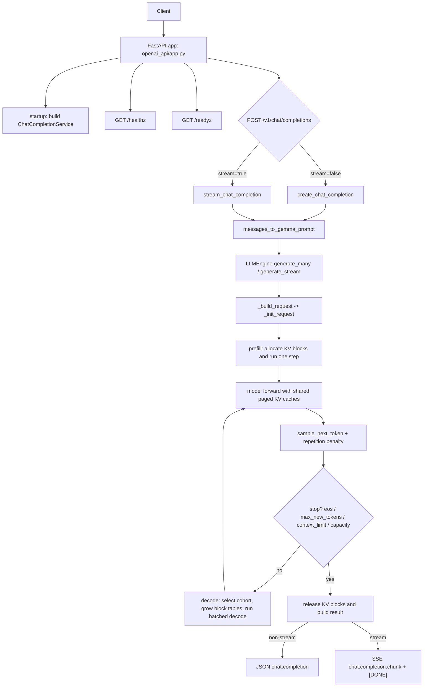

The Gemma 3 Inference Engine is organized into three cooperating layers: the `gemma3/` package holds the neural network, positional encodings, and KV storage primitives; the `engine/` package owns the request lifecycle, KV block allocator, and prefill/decode scheduler; and the `openai_api/` package exposes an OpenAI-compatible HTTP surface built on FastAPI. Each layer has a single responsibility and depends only on the layer below it, so you can read, test, or replace any one of them without touching the others.

## Three main layers

| Layer | Path | Responsibility |
|---|---|---|
| Model | `gemma3/` | Transformer forward pass, attention, RoPE, paged KV storage |
| Engine | `engine/` | Scheduler, KV block manager, sampling, request state |
| HTTP API | `openai_api/` | FastAPI app, OpenAI-compatible schemas, chat service |

The entry point for direct generation is `main.py`. The HTTP server is started via `python -m openai_api.run`, which initializes `ChatCompletionService` at boot so that model load failures surface immediately rather than on the first request.

## Model architecture

`Gemma3Model` (`gemma3/model.py`) is an 18-layer decoder-only transformer. Each `TransformerBlock` contains a `GroupedQueryAttention` module followed by a gated feedforward network (`down(gelu(gate(x)) * up(x))`), with four `RMSNorm` applications per block: `input_layernorm`, `post_attention_layernorm`, `pre_feedforward_layernorm`, and `post_feedforward_layernorm`.

The 270M configuration is defined as a single dict in `gemma3/model.py`:

```python
GEMMA3_CONFIG_270M = {
    "vocab_size": 262_144,
    "context_length": 32_768,
    "emb_dim": 640,
    "n_heads": 4,
    "n_layers": 18,
    "hidden_dim": 2048,
    "head_dim": 256,
    "qk_norm": True,
    "n_kv_groups": 1,
    "rope_local_base": 10_000.0,
    "rope_base": 1_000_000.0,
    "sliding_window": 512,
    "layer_types": [
        "sliding_attention",
        "sliding_attention",
        "sliding_attention",
        "sliding_attention",
        "sliding_attention",
        "full_attention",
        "sliding_attention",
        "sliding_attention",
        "sliding_attention",
        "sliding_attention",
        "sliding_attention",
        "full_attention",
        "sliding_attention",
        "sliding_attention",
        "sliding_attention",
        "sliding_attention",
        "sliding_attention",
        "full_attention",
    ],
    "dtype": torch.bfloat16,
    "query_pre_attn_scalar": 256,
}
```

The 18 layers follow a repeating pattern: five `sliding_attention` layers followed by one `full_attention` layer. Layers 0–4, 6–10, and 12–16 use a local RoPE base of `10_000.0` and a sliding window of 512 tokens. Layers 5, 11, and 17 use a global RoPE base of `1_000_000.0` and attend to the full context up to `32_768` tokens.

## Attention

`GroupedQueryAttention` (`gemma3/attention.py`) implements GQA without KV expansion. With `n_kv_groups=1` in the 270M config there is one KV head group and four query heads, giving a group size of four. The attention scale is derived from `query_pre_attn_scalar` as `256 ** -0.5`.

**RoPE** is applied per-token at the correct absolute offset, with separate `RotaryEmbedding` caches for local (`theta=10_000.0`) and global (`theta=1_000_000.0`) layers. When `qk_norm=True`, per-head `RMSNorm` is applied to Q and K before the dot product.

The attention mask is additive (`0` for allowed positions, `-inf` for blocked). For sliding-window layers the mask blocks keys whose absolute position is more than `sliding_window - 1 = 511` steps behind the query. Full-attention layers use PyTorch SDPA's built-in causal fast path when no past KV is present.

## Request flow



## Explore further

<CardGroup cols={2}>
  <Card title="Paged KV cache" href="/concepts/paged-kv-cache">
    How the block allocator manages KV memory across concurrent requests without wasting capacity.
  </Card>
  <Card title="Scheduler" href="/concepts/scheduler">
    How the prefill/decode scheduler batches requests and manages the full request lifecycle.
  </Card>
</CardGroup>
